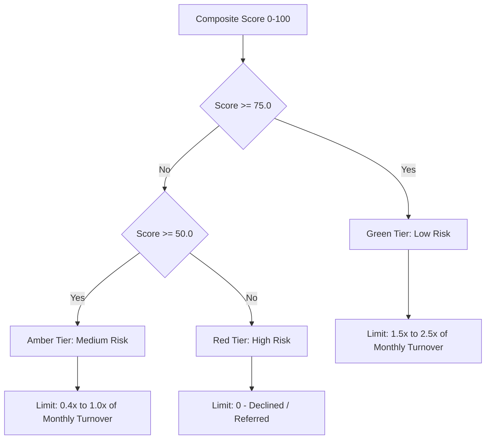

# IDBI Innovate: Financial Health Card API

IDBI Innovate is a revolutionary credit assessment tool that moves beyond traditional credit history (like CIBIL scores) to evaluate MSME (Micro, Small, and Medium Enterprises) creditworthiness in under 30 seconds using multiple alternative financial signals.

By fetching and analyzing real-time data from GST, UPI, EPFO, and Bank Statements in parallel, the engine computes a composite **Financial Health Score (0-100)** to automate and de-risk the loan approval process.

---

## 🏗️ Architecture & Component Design

The application is built with **FastAPI** for high-performance async capabilities and **Pydantic v2** for structured request/response validation. 

The core flow of the system consists of:
1. **Parallel Ingestion**: Fetches records from mocked sandbox services in parallel using `asyncio.gather` to keep response times under 30 seconds.
2. **Audit Logging & Resiliency**: The system creates a `ServiceAuditLog` for each upstream fetch, capturing latency and status. If non-core integrations (GST, UPI, EPFO) fail, the system falls back gracefully to default structures. If the core bank statement integration fails, it terminates with an error.
3. **Scoring Engine**: Evaluates the gathered financial parameters against a structured scoring rubric.

### File Structure Map

* 📂 [app/](file:///c:/Users/LENOVO/Desktop/IDBI%20innovate/app) — Main application directory
  * 📄 [main.py](file:///c:/Users/LENOVO/Desktop/IDBI%20innovate/app/main.py) — Application entry point, CORS middleware, and API router routing.
  * 📂 [core/](file:///c:/Users/LENOVO/Desktop/IDBI%20innovate/app/core) — Configuration and business logic
    * 📄 [config.py](file:///c:/Users/LENOVO/Desktop/IDBI%20innovate/app/core/config.py) — Pydantic Settings management (network delay, host, port).
    * 📄 [scoring.py](file:///c:/Users/LENOVO/Desktop/IDBI%20innovate/app/core/scoring.py) — Core scoring logic ([ScoringEngine](file:///c:/Users/LENOVO/Desktop/IDBI%20innovate/app/core/scoring.py#L4)) mapping and calculating MSME risk.
  * 📂 [api/](file:///c:/Users/LENOVO/Desktop/IDBI%20innovate/app/api) — Web API layer
    * 📄 [endpoints.py](file:///c:/Users/LENOVO/Desktop/IDBI%20innovate/app/api/endpoints.py) — Routes for scoring requests and health checks.
    * 📄 [schemas.py](file:///c:/Users/LENOVO/Desktop/IDBI%20innovate/app/api/schemas.py) — Request and response Pydantic models.
  * 📂 [services/](file:///c:/Users/LENOVO/Desktop/IDBI%20innovate/app/services) — Integration services and data adapters
    * 📄 [base.py](file:///c:/Users/LENOVO/Desktop/IDBI%20innovate/app/services/base.py) — Base service class and Exception hierarchy.
    * 📄 [gst.py](file:///c:/Users/LENOVO/Desktop/IDBI%20innovate/app/services/gst.py) — Ingestion adapter for GST filings and turnover.
    * 📄 [upi.py](file:///c:/Users/LENOVO/Desktop/IDBI%20innovate/app/services/upi.py) — Ingestion adapter for UPI velocity and volume analysis.
    * 📄 [epfo.py](file:///c:/Users/LENOVO/Desktop/IDBI%20innovate/app/services/epfo.py) — Ingestion adapter for payroll compliance.
    * 📄 [bank.py](file:///c:/Users/LENOVO/Desktop/IDBI%20innovate/app/services/bank.py) — Ingestion adapter for bank statement metrics.
    * 📄 [mock_data_store.py](file:///c:/Users/LENOVO/Desktop/IDBI%20innovate/app/services/mock_data_store.py) — Local data profiles database ([MockDataStore](file:///c:/Users/LENOVO/Desktop/IDBI%20innovate/app/services/mock_data_store.py#L472)).
* 📂 [tests/](file:///c:/Users/LENOVO/Desktop/IDBI%20innovate/tests) — Integration and unit test suite
  * 📄 [test_api.py](file:///c:/Users/LENOVO/Desktop/IDBI%20innovate/tests/test_api.py) — API client tests (health check, overrides, edge cases).
  * 📄 [test_scoring.py](file:///c:/Users/LENOVO/Desktop/IDBI%20innovate/tests/test_scoring.py) — Scoring engine validation on vendor, SaaS, and high-risk profiles.

---

## 📈 Scoring Engine Rubric

The [ScoringEngine](file:///c:/Users/LENOVO/Desktop/IDBI%20innovate/app/core/scoring.py#L4) computes a composite score by weighting four core categories:

| Component | Weight | Key Assessment Sub-factors |
| :--- | :---: | :--- |
| **Revenue Stability** | 30% | Month-on-month trend ratio (40% sub-weight) and monthly turnover volatility coefficient of variation (60% sub-weight). |
| **Tax Compliance** | 25% | GST filing rate (GSTR-1 & GSTR-3B) (40% sub-weight), EPFO payroll payment timeliness (40% sub-weight), and bank KYC status verification (20% sub-weight). |
| **Cash Flow Health** | 25% | UPI transaction volume velocity expansion (30% sub-weight), Average Daily Balance (ADB) buffer relative to monthly spend (40% sub-weight), and clearing bounces counts (30% sub-weight). |
| **Growth Trajectory** | 20% | Year-over-Year (YoY) revenue expansion (50% sub-weight) and customer concentration / customer retention (50% sub-weight). |

### Risk Tiers & Credit Limit Rules

Depending on the final composite score, the MSME is placed in one of three risk tiers:



---

## 🤖 Machine Learning Pipeline & Integration

In addition to the default rules-based rubric, the project features an advanced **Machine Learning credit-scoring pipeline** located in the `ml/` directory.

### ML Component Map
* 📂 [ml/](file:///c:/Users/LENOVO/Desktop/IDBI%20innovate/ml) — Machine Learning modules
  * 📄 [preprocessing.py](file:///c:/Users/LENOVO/Desktop/IDBI%20innovate/ml/preprocessing.py) — Ingests raw MSME profiles, GST, UPI, and EPFO datasets, cleans data, handles outliers, and joins them into a unified feature set.
  * 📄 [feature_engineering.py](file:///c:/Users/LENOVO/Desktop/IDBI%20innovate/ml/feature_engineering.py) — Performs category encoding, drops zero-variance and highly correlated features, scales the feature vector, and exports scaling metadata.
  * 📄 [train.py](file:///c:/Users/LENOVO/Desktop/IDBI%20innovate/ml/train.py) — End-to-end training module. Runs hyperparameter optimization via `optuna` for both XGBoost and LightGBM models, selects the best performer, applies Isotonic probability calibration, and saves the final models.
  * 📄 [predict.py](file:///c:/Users/LENOVO/Desktop/IDBI%20innovate/ml/predict.py) — Integrates with the backend. Exposes a `predict(data)` method that aligns raw nested request JSONs with model features, applies the scaler, runs inference, and computes the probability-weighted score.
  * 📄 [explain.py](file:///c:/Users/LENOVO/Desktop/IDBI%20innovate/ml/explain.py) — Utilizes **SHAP (SHapley Additive exPlanations)** to extract the top-K driving features for each prediction, generating mathematical explainability reports.

### Configuration & Hybrid Mode
The backend can toggle between the Machine Learning model and the rules-based rubric. This is managed via the `USE_ML_MODEL` environment variable (defined in `.env` and `config.py`):
* **`USE_ML_MODEL=True` (Default)**: Uses the trained XGBoost/LightGBM model and SHAP explainability to compute scores.
* **`USE_ML_MODEL=False`**: Uses the rules-based scoring engine as a robust fallback.

---

## 📊 Pre-configured Test Profiles

The system comes pre-configured with several profiles inside the [MockDataStore](file:///c:/Users/LENOVO/Desktop/IDBI%20innovate/app/services/mock_data_store.py#L472) to test various scoring scenarios:

1. **`raj_vendor`**: A vegetable vendor with **no active GST registration**, high UPI volume, small EPFO payroll, and a clean bank statement. Demonstrates GST-unregistered fallback pathways.
2. **`priya_saas`**: A high-growth SaaS startup with **100% GST/EPFO compliance**, lumpy contract-based UPI volume, and large credit limits.
3. **`default_high_risk`**: A retail business with **declining revenues**, poor filing histories, multiple clearing bounces, and negative average daily balances.
4. **Synthetic Generation**: Any other string passed as the `msme_id` triggers a deterministic synthetic profile seeded with the hash of that ID, allowing infinite test scenarios.

---

## 🚀 Getting Started

### Prerequisites

* Python 3.10+ (tested on Python 3.13)
* Git

### Local Installation

1. **Clone the repository and navigate into it**:
   ```bash
   git clone <repository_url>
   cd "IDBI innovate"
   ```

2. **Create and activate a virtual environment**:
   ```powershell
   # Windows PowerShell
   python -m venv .venv
   .\.venv\Scripts\activate
   ```

3. **Install the dependencies**:
   ```bash
   # Install backend dependencies
   pip install -r requirements.txt
   # Install ML dependencies
   pip install -r ml/requirements.txt
   ```

4. **Train the ML model (Required if `USE_ML_MODEL=True`)**:
   Before starting the server, run the training script to generate the model and scaling artifacts:
   ```bash
   .venv\Scripts\python -m ml.train
   ```

5. **Run the FastAPI server**:
   ```bash
   uvicorn app.main:app --reload
   ```
   * The API server will run on `http://localhost:8000`.
   * Interactive Swagger documentation is available at `http://localhost:8000/docs`.

### Running the Test Suite

Execute pytest via the virtual environment to run all endpoint and scoring tests:
```bash
.venv\Scripts\python -m pytest
```

---

## 🐳 Docker Deployment

The application is fully containerized and can be run using Docker and Docker Compose.

### Build and Run with Docker Compose

To start the API server locally inside a Docker container:
```bash
docker-compose up --build
```
This builds the image defined in [Dockerfile](file:///c:/Users/LENOVO/Desktop/IDBI%20innovate/Dockerfile) (using a secure multi-stage build that runs the app as a non-root `appuser`) and spawns the container configured in [docker-compose.yml](file:///c:/Users/LENOVO/Desktop/IDBI%20innovate/docker-compose.yml).

The server will be exposed on port `8000` with the healthcheck routing configured.

---

## 📡 API Reference

### 1. Evaluate Credit Score
* **Endpoint**: `POST /api/v1/score`
* **Content-Type**: `application/json`

**Sample Request Payload**:
```json
{
  "msme_id": "priya_saas"
}
```

**Alternative Testing Request (Direct Custom Payload Override)**:
You can bypass external database queries entirely to test score calculations directly:
```json
{
  "msme_id": "custom_override_test",
  "custom_override_data": {
    "gst": {
      "is_registered": true,
      "turnover_history": [{"month": "2026-01", "turnover": 1000000.0}],
      "filing_history": [{"month": "2026-01", "filing_type": "GSTR-1", "filed_on_time": true}]
    },
    "upi": {
      "unique_customers": 50,
      "customer_retention_rate": 0.85,
      "velocity_score": 1.2
    },
    "epfo": {
      "history": []
    },
    "bank": {
      "account_number": "12345",
      "bank_name": "Test Bank",
      "kyc_status": "Verified",
      "average_daily_balance": 150000.0,
      "bounces_count": 0,
      "monthly_metrics": [
        {
          "month": "2026-01",
          "avg_daily_balance": 150000.0,
          "total_credits": 1000000.0,
          "total_debits": 900000.0,
          "overdraft_usage_days": 0
        }
      ]
    }
  }
}
```

**Sample Response**:
```json
{
  "msme_id": "priya_saas",
  "composite_score": 87.25,
  "category": "Green",
  "recommendation": "Approve; offer best-rate credit products.",
  "confidence_score": 100.0,
  "recommended_credit_limit_inr": 8200000,
  "breakdown": {
    "revenue_stability": 91.2,
    "tax_compliance": 100.0,
    "cash_flow_health": 80.0,
    "growth_trajectory": 79.5
  },
  "reason_codes": [
    {
      "code": "TAX_GST_PERFECT",
      "type": "positive",
      "impact": 5.0,
      "text": "Perfect track record of timely GST returns (GSTR-1 & GSTR-3B) filing."
    },
    {
      "code": "CASH_BOUNCES_NONE",
      "type": "positive",
      "impact": 10.0,
      "text": "Exceptional banking discipline with zero outward clearing bounces."
    }
  ],
  "api_audit_logs": [
    {
      "service_name": "GSTN Sandbox",
      "status": "SUCCESS",
      "latency_seconds": 0.5012,
      "data_retrieved": true
    },
    {
      "service_name": "UPI NPCI Analytics",
      "status": "SUCCESS",
      "latency_seconds": 0.5009,
      "data_retrieved": true
    },
    {
      "service_name": "EPFO Compliance API",
      "status": "SUCCESS",
      "latency_seconds": 0.5021,
      "data_retrieved": true
    },
    {
      "service_name": "Open Banking API",
      "status": "SUCCESS",
      "latency_seconds": 0.5015,
      "data_retrieved": true
    }
  ]
}
```

### 2. Service Health check
* **Endpoint**: `GET /api/v1/health`

**Sample Response**:
```json
{
  "status": "healthy",
  "version": "1.0.0",
  "services_connected": {
    "GSTN_Sandbox": "connected",
    "UPI_NPCI_Analytics": "connected",
    "EPFO_Compliance_API": "connected",
    "Open_Banking_API": "connected"
  }
}
```
